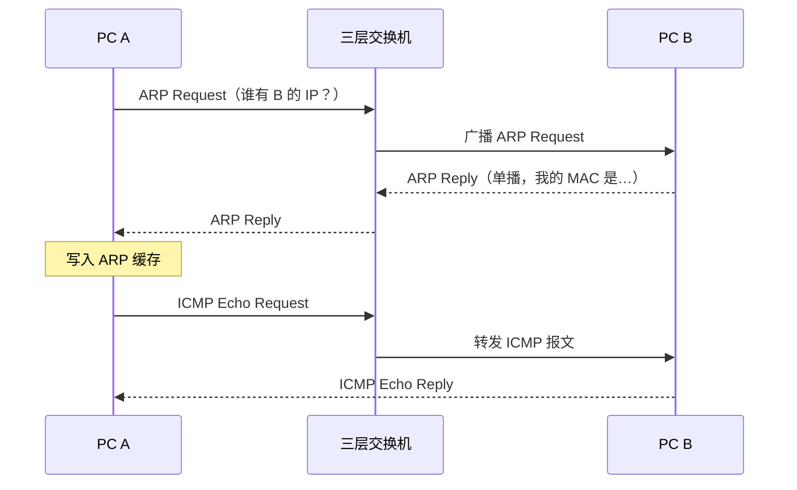
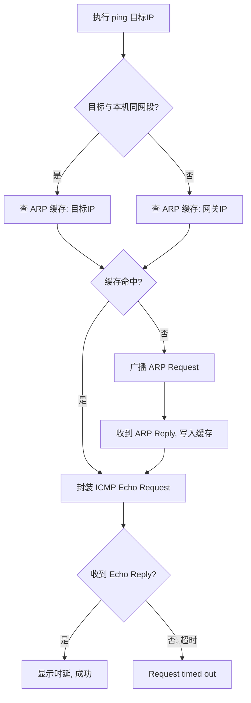

> 看懂一次 ping 的完整过程，就理解了二层地址解析与三层差错/查询报文如何配合工作。

## 学习目标

阅读本文后，你应该能够：

- 理解 ARP 解决什么问题、缓存如何工作。
- 掌握 ICMP Echo Request / Echo Reply 的报文交互。
- 说清楚同网段 ping 与跨网段 ping 时 ARP 请求目标的区别。

## 问题背景

`ping` 是最常用的网络排障命令，但很多人只把它当"通/不通"的黑盒。排障时真正有价值的是知道：不通，究竟卡在哪一层？是 ARP 没解析到 MAC，还是 ICMP 应答没回来？这决定了你该查交换机、查路由还是查主机防火墙。

## 核心概念

- **ARP（Address Resolution Protocol）**：已知对端 IP，求对端 MAC。请求以二层广播发出，应答单播返回，结果写入本机 ARP 缓存。
- **ICMP（Internet Control Message Protocol）**：IP 层的控制/查询协议。ping 使用的是其中的 Echo Request（type 8）与 Echo Reply（type 0）。
- **关键点**：同网段通信，ARP 解析的是**目标主机**的 MAC；跨网段通信，ARP 解析的是**默认网关**的 MAC。

## 工作流程

同网段两台 PC 经三层交换机互联时，一次 ping 的完整报文交互如下：



整体流程可以概括为：



## 详细过程

1. **判断网段**：本机用自己的 IP 和子网掩码计算，目标在同一网段则直接 ARP 解析目标；否则解析默认网关。
2. **查 ARP 缓存**：命中则直接使用；Windows 上可用 `arp -a` 查看。
3. **ARP 请求**：二层广播帧（目的 MAC 为 `ff:ff:ff:ff:ff:ff`），同一广播域内所有主机都会收到，只有 IP 匹配的主机应答。
4. **发送 ICMP**：拿到 MAC 后封装 Echo Request 发出，等待 Echo Reply。
5. **超时判断**：ICMP 超时与 ARP 无应答是两种不同的"不通"，前者说明三层可达性有问题，后者连二层解析都没完成。

## 示例代码

```text
# 查看 ARP 缓存
arp -a

# 清除 ARP 缓存（排障时常用，强制重新解析）
arp -d *

# ping 并观察 TTL 与用时
ping 192.168.1.1 -n 4

# 用 tracert 观察跨网段路径
tracert 8.8.8.8
```

## 实验或实践

### 实验环境

| 项目 | 内容 |
|---|---|
| 操作系统 | Windows 11 / FreeBSD 8.0 |
| 网络设备 | 三层交换机，两个 VLAN 各一台 PC |
| 抓包工具 | Wireshark |

### 实验步骤

1. `arp -d *` 清空本机 ARP 缓存。
2. 开始 Wireshark 抓包，过滤条件 `arp or icmp`。
3. `ping` 同网段主机，观察报文顺序。
4. 再次 `ping` 同一主机，观察是否还有 ARP 报文。

### 实验结果

- 第一次 ping：先出现一对 ARP Request/Reply，之后才是 ICMP Echo 交互。
- 第二次 ping：**没有** ARP 报文，直接发送 ICMP——因为缓存命中。
- 跨网段 ping：ARP 请求的目标 IP 变成了网关地址。

## 常见问题

### 问题一：为什么 ping 不通但 ARP 表里有对方的 MAC？

ARP 只解决二层寻址。有 MAC 说明二层解析成功，ping 不通应继续往上查：对方防火墙是否拦截 ICMP、回程路由是否正确。

### 问题二：为什么第一次 ping 经常丢第一个包？

首次通信需要先做 ARP 解析，第一个 Echo Request 常在解析完成前超时。这是正常现象，不是网络故障。

## 易错点

- 以为 ping 不通 = 对方关机：更常见的原因是防火墙丢弃 ICMP。
- 跨网段时对目标 IP 做 ARP：实际解析的是网关 MAC。
- 忽略 ARP 缓存过期导致的间歇性"首包超时"。

## 总结

一次 ping = 一次（可能发生的）ARP 解析 + 一对 ICMP Echo 交互。排障时先分清不通发生在哪一层，再决定排查方向，可以少走很多弯路。

## 延伸阅读

- [ping 不通时的分层排查思路](/blog/network-troubleshooting-layers/)

## 内容审核信息

- 内容质量评分：22/25
- 事实检查状态：已检查
- 是否需要人工审核：否
- 自动生成时间：2026-09-11
