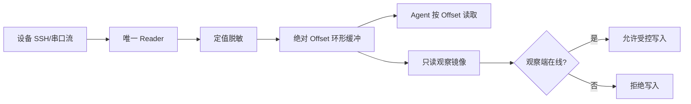
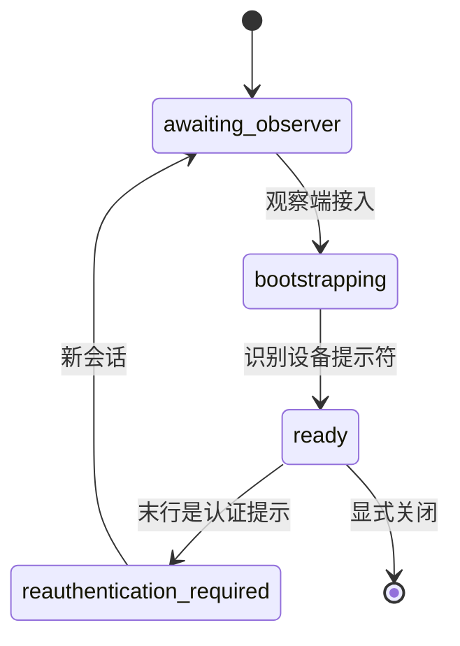

## 学习目标

- 理解为什么一个设备会话只能有一个底层输出读取者。
- 用绝对 offset 让自动化、状态查询和人工观察并行读取同一份输出。
- 为串口、长任务和凭据生命周期建立可审计的安全边界。

## 问题背景

网络设备自动化并不是“执行一条 SSH 命令”这么简单。串口和 SSH 会持续输出；若多个消费者直接读取同一个流，就会互相抢走数据。更危险的是：人看不到时，自动化仍在配置设备，或者设备因空闲退回登录提示后把业务命令当成用户名。

## 核心设计

- **唯一 reader**：每个会话只有一个后台线程消费传输层输出，其余角色只读缓冲，避免竞争读取。
- **绝对 offset**：缓冲淘汰旧字节后仍保留单调递增位置；调用者能从上次位置继续读，并识别数据是否已被截断。
- **两把锁**：命令周期由 `command_lock` 串行化，底层字节写入由 `write_lock` 保护，避免命令、控制键与认证内容交错。
- **只读镜像门禁**：镜像仅绑定本机回环地址；没有实际观察客户端时，拒绝业务命令、控制键和自动翻页。

## 串口的额外状态机

串口连接不能假设立即可操作。正确路径是：建立传输 → 等待观察端连接 → 在可见状态完成登录 bootstrap → 进入 ready。每次业务写入前还要检查缓冲最后一个非空行：若匹配 `login:`、`username:` 或 `password:`，任何业务字节都不能发送，应关闭旧会话并走重新认证流程。

## 实现要点

1. 缓冲容量固定，读取 API 返回 `next_offset` 与 `truncated`，调用方不用猜测哪些输出已消费。
2. 脱敏器要跨 chunk 保存“可能组成秘密的后缀”，避免口令恰好跨读块边界而泄漏。
3. SSH 指纹属于可选的调用方校验：提供时必须在认证前比对；未提供时也要确保目标授权范围已经明确。
4. 原始控制键只允许有限白名单。尤其不要让任意文本绕过命令锁直接写入设备。
5. `observer_connected` 仅表示本机有人连到镜像，不代表身份认证；它解决的是操作可见性，不是访问控制。

## 验证清单

- 并行打开自动化读取和观察窗口，确认两端都能从各自 offset 获取连续输出。
- 断开观察端后，验证写入接口被拒绝而只读接口仍可工作。
- 模拟空闲后认证提示，确认业务命令没有被发送。
- 用编译检查、工具清单、错误 schema 和真实会话状态共同验证实现，而不是只检查“连接成功”。

## 边界与总结

此设计不能自动识别设备输出中的所有敏感内容；它只会脱敏 MCP 已收集的认证值。因此运行配置、调试输出和截图仍须人工脱敏。把单 reader、位置化读取与可见写入组合起来，终端自动化才能从“能跑”升级为可审计、可恢复的操作系统。

## 内容审核信息

- 内容质量评分：24/25（accuracy 5、completeness 5、clarity 5、practical_value 5、reusability 4）
- 事实检查状态：基于项目实现与已验证经验整理
- 是否需要人工审核：否
- 自动生成时间：2026-09-11
