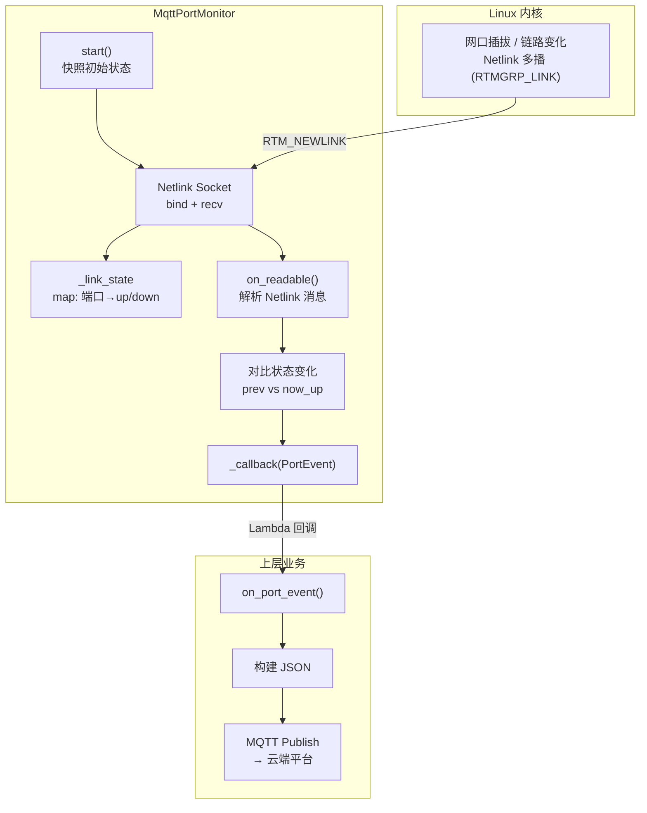

# C++ Lambda 与 Netlink Socket 学习笔记：网络端口状态监控模块

> 记录一个网络端口状态监控模块的实现：Netlink 监听内核链路变化 → Lambda 回调 → JSON → MQTT 上报。

## 概述

本文记录了一个**网络端口状态监控模块**的实现。通过 Linux Netlink Socket 监听内核网络接口 up/down 变化，经 Lambda 回调构建 JSON，通过 MQTT 上报云端。

- **C++ Lambda** — 作为回调实现模块间解耦
- **Netlink Socket** — 内核与用户空间通信
- **EventLoop** — 单线程异步 I/O
- **状态机** — 快照初始状态 + 增量检测

### 架构流程图



## 1. C++ Lambda 表达式作为回调

### 什么是 Lambda

Lambda 是 C++11 引入的匿名函数，语法：`[捕获](参数) { 函数体 }`

### 实际用法

```cpp
_port_monitor = new MqttPortMonitor(
    [this](const MqttPortMonitor::PortEvent& ev) {
        on_port_event(ev);
    });
```

> **理解**
>
> - `[this]` — 捕获 this，可调用当前类成员函数
> - `(const PortEvent& ev)` — 接收端口事件引用
> - 好处：就地定义、就地使用，不用单独写函数

### 类原型

```cpp
class MqttPortMonitor {
public:
    struct PortEvent {
        std::string port_id, status, prev_status;
    };
    typedef std::function<void(const PortEvent&)> EventCallback;
};
MqttPortMonitor::MqttPortMonitor(EventCallback cb)
    : _callback(cb), _nl_fd(-1) {}
```

## 2. Netlink Socket — 监听内核端口状态

```cpp
bool MqttPortMonitor::start() {
    _nl_fd = socket(AF_NETLINK, SOCK_DGRAM, NETLINK_ROUTE);
    struct sockaddr_nl addr = {};
    addr.nl_family = AF_NETLINK;
    addr.nl_groups = RTMGRP_LINK;  // 订阅链路变化
    bind(_nl_fd, ...);
    // 快照 /sys/class/net/ 下所有端口初始状态
}
```

**参数说明**：

| 参数 | 含义 |
|---|---|
| `AF_NETLINK` | 内核⇔用户空间通信 |
| `NETLINK_ROUTE` | 路由/网络接口子系统 |
| `RTMGRP_LINK` | 链路层 up/down 事件组 |

> **为什么快照？** Netlink 只推送后续变化。启动前已有的状态不会推送，所以先遍历记录初始值。

## 3. 事件循环集成

```cpp
int fd = _port_monitor->get_fd();
_eventloop.add_ioevent_cb(fd, IOT_READ,
    callback(this, &Target::on_port_monitor_readable));
```

Netlink fd 注册到 EventLoop 的 `IOT_READ`。内核推送时 fd 可读 → 自动触发回调。单线程，无锁。

## 4. on_readable() — 解析 Netlink 消息

```cpp
void MqttPortMonitor::on_readable() {
    char buf[4096];
    ssize_t len = recv(_nl_fd, buf, sizeof(buf), MSG_DONTWAIT);
    for (nlmsghdr* nh = ...; NLMSG_OK(nh, len); ...) {
        if (nh->nlmsg_type != RTM_NEWLINK) continue;
        // 提取接口名 + flags
        bool now_up = (flags & IFF_LOWER_UP) != 0;
        // 对比 _link_state，没变就跳过
        if (_callback) _callback(ev);
    }
}
```

> **IFF_LOWER_UP vs IFF_UP**：`IFF_UP` = 管理员启用接口（网线可能没插）。`IFF_LOWER_UP` = 物理层检测到载波，网线真正连通。

## 5. 回调处理 — JSON + MQTT

```cpp
void Target::on_port_event(const PortEvent& ev) {
    if (!_mqtt_client.is_connected()) return;
    // 构建 ISO 8601 时间戳 + 唯一 msgId
    // JSON: {schemaVer, cmd, msgId, params:{portId, status, prevStatus, time}}
    publish_event(topic, json, 1);  // QoS 1
}
```

## 6. 停止监控

```cpp
void MqttPortMonitor::stop() {
    if (_nl_fd >= 0) { close(_nl_fd); _nl_fd = -1; }
    _link_state.clear();
}
```

## 7. 设计巧妙之处

- **事件驱动零轮询** — Netlink 内核推送，CPU 近零
- **Lambda 解耦** — Monitor 不知上层是什么，零耦合
- **快照+增量** — 只在真正变化时触发
- **单线程 EventLoop** — fd 注册，无锁
- **IFF_LOWER_UP** — 物理层载波，更准确
- **防御性** — 未知接口视为变化；未连接优雅丢弃

## 总结

这个模块的核心思路是"内核推送 + 快照增量 + Lambda 解耦"：用 Netlink 订阅代替轮询，用启动快照补全初始状态，用 `std::function` 回调让监控模块与业务层零耦合。这套组合在嵌入式 Linux 状态监控场景中非常通用。

## 内容审核信息

- 内容质量评分：22/25
- 事实检查状态：已检查（迁移自旧博客，SVG 架构图已重绘为 Mermaid）
- 是否需要人工审核：否
- 迁移时间：2026-09-11
