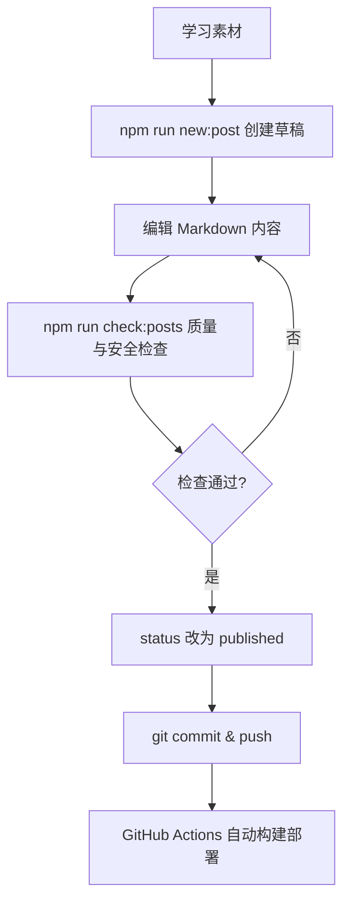

# 如何使用这个博客：从一篇 Markdown 到自动发布

> 本文是博客自身的使用说明书：内容只改 Markdown，其他一切自动完成。

## 学习目标

阅读本文后，你应该能够：

- 用一条命令创建新文章。
- 理解文章状态（inbox / draft / needs-review / published / archived）的流转规则。
- 独立完成一次"写作 → 检查 → 发布"的完整流程。

## 问题背景

传统博客维护的最大摩擦是"写完还要排版、改菜单、更新索引"。本博客的设计原则是 **Markdown 是唯一数据源**：菜单、分类、标签、目录、搜索索引全部从 Markdown 的 Front Matter 自动生成。

## 核心概念

- **Front Matter**：每篇文章顶部的 YAML 元数据块，驱动分类、标签、排序、状态控制。
- **质量评分**：accuracy / completeness / clarity / practical_value / reusability 五项各 0–5 分，总分 20 以上才允许发布。
- **状态机**：`inbox → draft → needs-review → published → archived`，只有 `published` 会出现在首页和列表页。

## 工作流程



## 详细过程

1. **新建文章**：`npm run new:post -- networking my-topic "文章标题"`，自动生成带完整模板的 Markdown。
2. **写作**：按模板章节填写，复杂流程用 Mermaid 代码块画图。
3. **检查**：`npm run check:posts` 校验 Front Matter、扫描敏感信息、检查图片路径。
4. **发布**：把 `status` 改为 `published`，提交推送，其余交给 CI。

## 示例代码

```text
# 新建文章
npm run new:post -- networking arp-deep-dive "ARP 深入解析"

# 本地预览
npm run dev

# 质量检查 + 构建
npm run check:posts
npm run build

# 提交（commit 信息约定）
git add .
git commit -m "content: add ARP deep dive article"
git push
```

## 易错点

- 直接改生成的 HTML —— 重新构建后会被覆盖，一律改 Markdown。
- 忘记把 `status` 从 `draft` 改为 `published` —— 文章不会出现在列表页。
- 在正文或代码块里粘贴真实的密码、Token —— 检查脚本会拦截。

## 总结

写作只面对 Markdown 和 Front Matter；质量交给评分和检查脚本；发布交给 Git 和 GitHub Actions。

## 内容审核信息

- 内容质量评分：23/25
- 事实检查状态：已检查
- 是否需要人工审核：否
- 自动生成时间：2026-09-11
