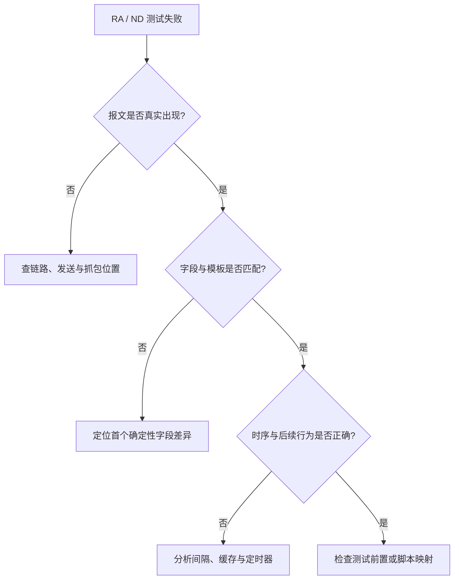
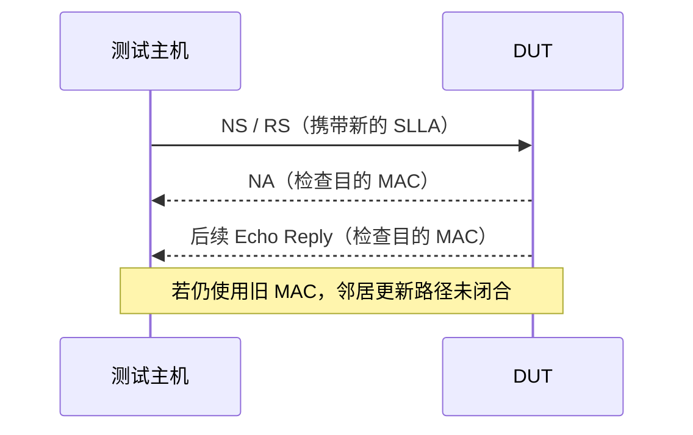

## 学习目标

- 不把测试框架的“未观察到”误读成链路上完全没有报文。
- 用字段、时间和二层目的地址分别验证 RA 与 ND 的不同命题。
- 区分邻居缓存更新、重传定时器未取消和配置未下沉等问题。

## 从一句失败提示开始拆题

IPv6 Ready 中的 `Could't observe RA` 表示没有找到**符合候选模板**的 RA，而不是一定没有收到 RA。一个 RA 只要二层目的地址、基本字段、选项内容或时序不满足模板，就可能被标记为 unexpected，并阻止脚本进入下一步检查。

因此需要将一个“失败”拆成三个独立命题：

## RA：存在性、字段匹配与周期要分开验证

建议按以下顺序取证：

1. 从日志的 `CommandLine` 确认实际脚本和接收模板，不要仅按用例标题猜测。
2. 在 `recv unexpected packet` 一类记录中定位第一个确定性字段差异，例如 Lifetime、ReachableTime、RetransTimer、MTU 或前缀信息。
3. 用同一轮 HTML 与 PCAP 交叉验证；HTML 常为秒级时间，边界周期应以 PCAP 微秒时间戳计算相邻间隔。
4. 只有字段已匹配、脚本真正进入周期判定时，周期结论才有意义。

这套顺序能避免把“字段不匹配”误归因为“设备没发 RA”。同时，旧归档抓包不能替代新一轮复测，因为配置、脚本和测试床都可能已经变化。

## ND：IPv6 地址相同不代表二层邻居已更新

ND 的难点常出现在 Source Link-Layer Address（SLLA）更新后。即使上层 IPv6 地址不变，DUT 后续的 NA 或 Echo Reply 仍可能先发往旧 MAC，之后才切换到新 MAC。排查时应同时记录：NS 或 RS 的以太网源地址、SLLA 选项、NA 的目的 MAC，以及后续单播流量的目的 MAC。

不要只看邻居表的一行输出就宣布符合 RFC NUD。项目中的数据面表字段可能表示最后更新时间、内部标志或引用计数，而不是 INCOMPLETE、REACHABLE、STALE、DELAY、PROBE 等标准状态。状态判断必须由控制面日志和报文行为共同支撑。

## 重传问题的两个方向

地址解析期间，未收到 NA 时重发 NS 是预期行为；收到有效 solicited NA 后仍继续重发，则应重点检查 INCOMPLETE 重传定时器是否被取消。若已经配置较大的 `retrans-time`，实际间隔却始终不变，需要沿“CLI → 配置 API → 数据面消费者”追踪，确认配置没有被默认值覆盖。

一个有效的对照实验是分别设置短、长两个间隔，使用 PCAP 比较未解析成功时的相邻 NS 时间；随后再验证收到 NA 后是否立即停止重传。这样能分开证明“参数没有生效”和“参数生效但取消逻辑错误”。

## 证据质量检查表

- 使用同一轮日志、PCAP 和设备状态，避免跨轮拼接证据。
- 主测试刺激没有执行时，只能归因为初始化、等待或测试床前置失败。
- 每个结论同时说明观察到的行为、规范或模板预期，以及尚未证实的边界。
- MAC、IPv6 前缀、接口名、主机名和抓包业务载荷在公开前必须脱敏。

## 总结

IPv6 报文排障的关键不是拥有更多日志，而是先把一个失败拆成可以被独立推翻的命题。报文是否存在、字段是否符合、时序是否正确、邻居状态是否真正更新，分别取得证据后，测试框架的模糊文案才会变成可修复的工程结论。

## 内容审核信息

- 内容质量评分：24/25（accuracy 5、completeness 5、clarity 5、practical_value 5、reusability 4）
- 事实检查状态：基于项目日志、报文分析与已验证恢复经验整理
- 是否需要人工审核：否
- 自动生成时间：2026-09-11
