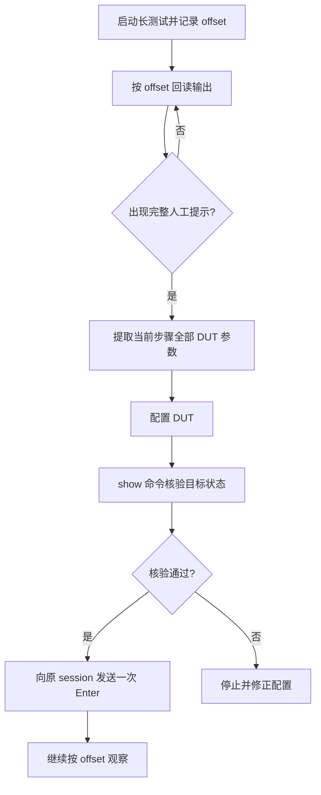

## 学习目标

- 区分命令调用结束、测试控制提示和测试真正结束三个状态。
- 在人工提示阶段先配置并核验 DUT，再继续原测试会话。
- 发生误操作时，用可重复的恢复流程替代“继续跑看看”。

## 为什么 completed 不等于测试完成

长测试启动后，通用的提示符匹配可能过早把 `racontrol>` 当成命令完成；但完整的设备配置说明和“按 Enter 继续”的语句稍后才输出。此时直接回车会让测试在 DUT 未正确配置的情况下继续，后续失败也不再具有诊断价值。

正确的判断对象不是单一状态字段，而是**从启动 offset 回读的完整输出、当前进程状态，以及真实 shell 或设备提示符**。

## 一套可恢复的操作规则

1. **保留原 session**：`autorun`、控制程序和报文进程的上下文绑定在原会话；并行重启会丢失交互位置。
2. **只处理当前提示**：完整读取当前人工说明，配置并验证当前要求；不要提前配置后续步骤，也不要重复回车。
3. **分页逐页推进**：遇到 ANSI `--more--` 时，一次只发送一个空格，每页都从上次 `next_offset` 继续读取。
4. **帮助命令是特殊输入**：设备行内 `?` 可能留下未执行文本。出现重复回显、未知命令或参数错误时，本次输入不算成功；等待干净提示符后重发一次并回读验证。
5. **Shell 语法要匹配实际环境**：远端是 `csh` 或 `tcsh` 时，Bourne 风格循环需要显式交给 `/bin/sh -c`，不能原样重试。

## 误回车后为什么必须作废本轮

误回车的恢复不是“补上配置然后继续”。测试已经在错误前置下运行，日志中的失败点无法证明 DUT 行为。推荐流程如下：

其中“确认真实 shell”很关键：控制提示符不是 shell 提示符。只有中止后确认测试相关进程已退出，才能将新一次执行与污染的旧结果分开。

## 串口空闲重认证与可见性

串口长期空闲可能回到登录提示。此时下一条 `show` 或配置命令若直接发送，会被当成认证输入。正确做法是检查最新非空末行；发现认证提示则不写入、关闭旧会话、重新采集凭据，并在同一新会话恢复只读观察镜像。观察端中途断开也应停止写入，恢复镜像后从旧 offset 继续，而不是另开并行控制会话。

## 复测前检查表

- 已从启动位置读到完整人工提示，而不只是控制程序提示符。
- DUT 当前配置已由目标 `show` 命令核验。
- 观察端在线，且操作与观察绑定到同一会话。
- 误操作后的旧进程、旧输出和旧结论均已隔离。
- 结论仅使用按真实步骤重跑的新日志与报文证据。

## 总结

长测试最可靠的自动化不是更快地按键，而是把每个可继续点建模为“读取证据 → 配置 → 验证 → 继续”。当错误发生时，让本轮失效、清理并从可证明的边界重跑，比从污染日志中猜根因更节省时间。

## 内容审核信息

- 内容质量评分：24/25（accuracy 5、completeness 5、clarity 5、practical_value 5、reusability 4）
- 事实检查状态：基于项目中多轮测试恢复经验整理
- 是否需要人工审核：否
- 自动生成时间：2026-09-11
